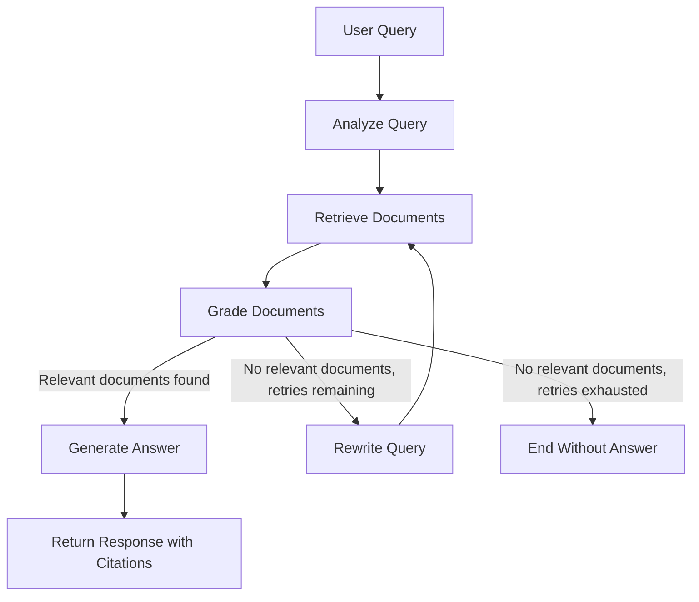

# RAG Technical Documentation Assistant

A Retrieval-Augmented Generation (RAG) system that answers technical
documentation questions using a self-corrective LangGraph workflow:
it analyzes the query, retrieves candidate chunks from a ChromaDB
vector store, grades them for relevance, rewrites and retries the
query when nothing relevant is found, and generates a grounded,
cited answer through a FastAPI REST API.

---

## Features

- Document ingestion from local files (PDF & Markdown)
- Recursive chunking
- Persistent ChromaDB vector database
- BAAI/bge-small-en-v1.5 embeddings
- Semantic similarity search
- Query analysis (classification + rewrite) before retrieval
- LLM-based document relevance grading
- Conditional routing: generate, retry, or stop based on grading
- Query rewriting with a bounded retry loop
- Cited answers, grounded only in retrieved context
- LangGraph orchestration
- FastAPI REST API with ingestion, listing, and feedback endpoints

---

## How It Works

1. The user's query is classified (conceptual / how-to / troubleshooting /
   API reference) and rewritten for better retrieval.
2. The rewritten query is embedded and used to retrieve the top-k most
   similar chunks from ChromaDB.
3. Each retrieved chunk is graded for relevance to the query by an LLM.
4. **If relevant chunks were found:** the system generates an answer
   grounded in those chunks, citing their source documents.
5. **If no relevant chunks were found and retries remain:** the query is
   rewritten and retrieval is retried.
6. **If no relevant chunks were found and retries are exhausted:** the
   workflow ends without fabricating an answer.

---

## Architecture



---

## Project Structure

```text
rag-assistant/
├── app/
│   ├── api/
│   │   └── routes.py
│   ├── graph/
│   │   ├── workflow.py
│   │   ├── nodes.py
│   │   └── state.py
│   ├── ingestion/
│   │   ├── loader.py
│   │   ├── chunker.py
│   │   └── ingest.py
│   ├── retriever/
│   │   └── retriever.py
│   ├── config.py
│   ├── prompts.py
│   ├── schemas.py
│   └── main.py
├── data/
│   └── raw/            # sample corpus (FastAPI, LangGraph, vector DB basics)
├── tests/
│   └── test_api.py
├── README.md
├── pyproject.toml
└── .env.example
```

---

## Tech Stack

- Python 3.11+
- FastAPI
- LangGraph
- ChromaDB
- HuggingFace Sentence Transformers (BAAI/bge-small-en-v1.5)
- Groq
- Pydantic v2
- uv
- Pytest

---

## Prerequisites

- Python 3.11 or newer
- uv package manager
- A Groq API key

---

## Installation

```bash
git clone <repository-url>
cd rag-assistant

uv venv
uv sync
```

---

## Environment Variables

Copy the example file and fill in your own values — `.env` is
git-ignored, so each person running this project needs to create
their own local copy with their own Groq API key (get one free at
[console.groq.com](https://console.groq.com)). Never commit `.env`
or share your key publicly.

```bash
cp .env.example .env
```

`.env`:

```env
GROQ_API_KEY=your-groq-api-key
MODEL_NAME=llama-3.1-8b-instant
EMBEDDING_MODEL=BAAI/bge-small-en-v1.5
```

If `GROQ_API_KEY` is missing or empty, the app fails fast at startup
with a `RuntimeError` naming the missing variable, instead of
crashing later on the first request to `/api/query`.

---

## Document Corpus

Three original short documents are included under `data/raw/` so the
project runs out of the box: `fastapi_basics.md`, `langgraph_basics.md`,
and `vector_databases_basics.md`. Add your own `.pdf` or `.md` files to
the same directory to extend the corpus.

---

## Ingest Documents

**Option A — standalone script:**

```bash
uv run python -m app.ingestion.ingest
```

**Option B — API endpoint** (also accepts file uploads, saved into
`data/raw/` before ingesting):

```bash
curl -X POST http://localhost:8000/api/ingest \
  -F "files=@my_doc.pdf"
```

Either path loads documents, splits them into chunks, embeds them, and
stores the vectors in ChromaDB.

---

## Run the API

```bash
uv run uvicorn app.main:app --reload
```

- App: `http://localhost:8000`
- Interactive docs: `http://localhost:8000/docs`

---

## API Endpoints

| Method | Endpoint       | Purpose                                   |
|--------|----------------|--------------------------------------------|
| GET    | `/`            | Health check                               |
| POST   | `/api/query`   | Submit a question, get an answer + sources |
| POST   | `/api/ingest`  | Ingest documents (optional file uploads)   |
| GET    | `/api/documents` | List documents currently in the corpus   |
| POST   | `/api/feedback`  | Submit thumbs up/down + optional comment |

### Example: `POST /api/query`

Request:

```json
{
  "query": "How do conditional edges work in LangGraph?"
}
```

Response:

```json
{
  "query": "How do conditional edges work in LangGraph?",
  "answer": "A conditional edge uses a router function to inspect the current state and decide which node to run next [source: langgraph_basics.md]...",
  "sources": ["langgraph_basics.md"]
}
```

### Example: `POST /api/feedback`

Request:

```json
{
  "query": "How do conditional edges work in LangGraph?",
  "answer": "A conditional edge uses a router function...",
  "rating": "up",
  "comment": "Clear and accurate"
}
```

Response:

```json
{
  "message": "Feedback recorded."
}
```

Feedback is appended as JSON lines to `data/feedback.jsonl` (not
committed to version control).

---

## Design Decisions & Tradeoffs

- **Chunking strategy:** `RecursiveCharacterTextSplitter` with a 1000-character
  chunk size and 200-character overlap. Recursive splitting tries paragraph and
  sentence boundaries before falling back to a hard character cut, which keeps
  most chunks topically coherent; the overlap reduces the chance that a
  relevant sentence is split across two chunks and missed by either one.
- **Grading is a per-chunk LLM call**, not a single batched call, favoring
  simplicity and per-chunk accuracy over latency. With more time this would
  be batched into one structured-output call to cut latency and cost.
- **Citations are extracted deterministically** from each relevant document's
  `source` metadata (not parsed out of the LLM's free-text answer), so the
  `sources` field in the API response is reliable even if the model's inline
  citation formatting varies.
- **Retry limit (`MAX_RETRIES = 2`)** is a fixed constant rather than
  user-configurable, to keep the assignment's core loop simple and bounded.
- **Feedback storage** is a local JSON-lines file rather than a database,
  since the assignment scope doesn't call for persistence infrastructure —
  swapping in a real datastore is a contained change if needed.

## Assumptions

- A Groq-hosted Llama model is used for all LLM calls (query analysis,
  grading, rewriting, generation); any other provider could be substituted
  behind the same `ChatGroq`-shaped call.
- The corpus is small enough that per-chunk LLM grading is acceptably fast;
  this would need batching or a lighter-weight grader at larger scale.

## What I'd Improve With More Time

- Hallucination / groundedness check node (Self-RAG style) before returning
  an answer.
- Batch document grading into a single structured-output LLM call.
- Web search fallback when the corpus has no relevant results.
- Conversation memory for follow-up questions.
- A minimal Streamlit/Gradio UI.
- Docker deployment and request-level observability/tracing.

---

## Testing

```bash
uv run pytest
```

Covers the health check, `/api/query` (with the graph mocked),
`/api/documents`, `/api/ingest` (with ingestion mocked), and
`/api/feedback`.
