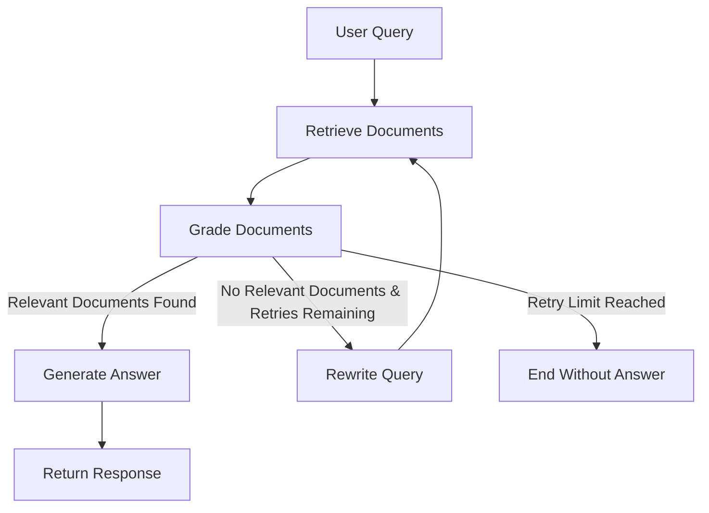

# RAG Technical Documentation Assistant

A Retrieval-Augmented Generation (RAG) system that answers technical documentation questions by combining semantic search over a ChromaDB vector store with an LLM-driven LangGraph workflow. The application retrieves relevant documents, evaluates their relevance, optionally rewrites the query when insufficient context is found, and generates grounded responses through a FastAPI REST API.

---

## Features

- Document ingestion from local files
- PDF & Markdown document support
- Recursive document chunking
- Persistent ChromaDB vector database
- BAAI/bge-small-en-v1.5 embeddings
- Semantic similarity search
- LLM-based document relevance grading
- Query rewriting & retry workflow
- LangGraph orchestration
- FastAPI REST API
- Modular and production-friendly project structure

---

## How It Works

1. Documents are loaded from the local data directory.
2. Documents are recursively split into manageable chunks.
3. Each chunk is embedded using **BAAI/bge-small-en-v1.5** and stored in **ChromaDB**.
4. A user query is embedded and used to retrieve semantically similar documents.
5. Retrieved documents are graded for relevance using an LLM.
6. If relevant documents are found, the system generates a grounded answer.
7. Otherwise, the workflow rewrites the query and retries retrieval until the retry limit is reached.

---

## Architecture



---

## Project Structure

```text
rag-assistant/
├── app/
│   ├── api/
│   │   └── routes.py
│   ├── graph/
│   │   ├── workflow.py
│   │   ├── nodes.py
│   │   └── state.py
│   ├── ingestion/
│   │   ├── loader.py
│   │   ├── chunker.py
│   │   └── ingest.py
│   ├── retriever/
│   │   └── retriever.py
│   ├── config.py
│   ├── prompts.py
│   ├── schemas.py
│   └── main.py
├── data/
│   └── raw/
├── tests/
│   └── test_api.py
├── README.md
├── pyproject.toml
└── .env.example
```

---

## Tech Stack

- Python 3.11+
- FastAPI
- LangGraph
- ChromaDB
- HuggingFace Sentence Transformers
- BAAI/bge-small-en-v1.5
- Groq
- Pydantic v2
- uv
- Pytest

---

## Prerequisites

Before running the project, ensure you have:

- Python 3.11 or newer
- uv package manager
- A Groq API key

---

## Installation

Clone the repository and install the dependencies.

```bash
git clone <repository-url>
cd rag-assistant

# Create a virtual environment
uv venv

# Install dependencies
uv sync
```

---

## Environment Variables

Copy the example environment file.

```bash
cp .env.example .env
```

Update the `.env` file with your credentials.

```env
GROQ_API_KEY=your-groq-api-key
MODEL_NAME=llama-3.1-8b-instant
EMBEDDING_MODEL=BAAI/bge-small-en-v1.5
```

> **Note:** Ensure that `app/config.py` uses the same default embedding model (`BAAI/bge-small-en-v1.5`) to remain consistent with this documentation.

---

## Ingest Documents

Place your documentation files inside:

```text
data/raw/
```

Supported formats:

- `.pdf`
- `.md`

Run the ingestion pipeline:

```bash
uv run python -m app.ingestion.ingest
```

This will:

- Load documents
- Split them into chunks
- Generate embeddings
- Store vectors in ChromaDB

---

## Run the API

Start the FastAPI server.

```bash
uv run uvicorn app.main:app --reload
```

The application will be available at:

```text
http://localhost:8000
```

Interactive API documentation:

```text
http://localhost:8000/docs
```

Health check endpoint:

```http
GET /
```

Example response:

```json
{
  "status": "healthy",
  "service": "RAG Chatbot API"
}
```

---

## Example API Request

### Request

```http
POST /api/query
Content-Type: application/json
```

```json
{
  "query": "What is LangGraph?"
}
```

### Response

```json
{
  "query": "What is LangGraph?",
  "answer": "LangGraph is a library for building stateful, multi-step workflows on top of language models using graph-based execution."
}
```

---

## Testing

Run the test suite using:

```bash
uv run pytest
```

The current test suite includes:

- Health endpoint tests
- API integration tests with mocked graph execution

---

## Future Improvements

- Streaming LLM responses
- Hybrid retrieval (keyword + semantic search)
- Metadata filtering
- Source citation support
- Conversation memory
- Docker deployment
- Kubernetes deployment
- Request tracing and observability
- Authentication and rate limiting

---

## Project Highlights

- Modular architecture with clear separation of concerns
- Persistent vector storage using ChromaDB
- LangGraph-based workflow orchestration
- Retrieval-Augmented Generation (RAG) pipeline
- LLM-assisted document grading
- Query rewriting with retry mechanism
- FastAPI REST interface
- Automated API testing with Pytest
- Easy local development using uv